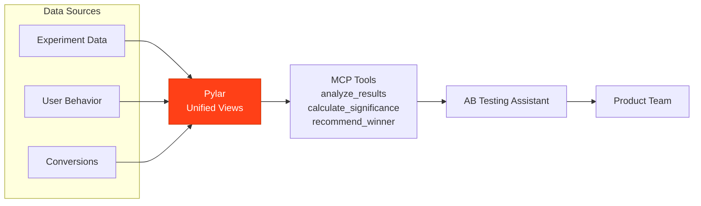

## Overview

An A/B Testing Assistant powered by Pylar analyzes experiment data, calculates statistical significance, and provides clear recommendations on which variant performs better.

## What the Agent Needs to Accomplish

The agent must:
- Analyze A/B test results
- Calculate statistical significance
- Compare variant performance
- Recommend winning variants
- Track experiment progress
- Identify significant differences

## How Pylar Helps

Pylar enables the agent by:
- **Unified Experiment View**: Combining experiment data, user behavior, and conversion data
- **Statistical Analysis**: Automated significance calculations
- **Real-time Monitoring**: Querying current experiment performance
- **Clear Recommendations**: Data-driven variant recommendations



## Without Pylar vs With Pylar

### Without Pylar

**Challenges**:
- ❌ Manual statistical calculations
- ❌ Complex experiment data aggregation
- ❌ Time-consuming analysis
- ❌ Limited real-time monitoring

**Implementation Complexity**: ~4-5 weeks

### With Pylar

**Benefits**:
- ✅ Automated statistical analysis
- ✅ Real-time experiment monitoring
- ✅ Clear winner recommendations
- ✅ Easy experiment tracking

**Implementation Complexity**: ~5-6 hours

## Step-by-Step Implementation

### Step 1: Connect Data Sources

1. **Connect Experiment Platform** (A/B test data, variants)
2. **Connect Analytics** (User behavior, conversions)
3. **Connect Product Data** (Feature usage, engagement)

### Step 2: Create Experiment Views

**Experiment Results View**:
```sql
CREATE VIEW experiment_results AS
SELECT 
  e.experiment_id,
  e.experiment_name,
  e.variant,
  COUNT(DISTINCT u.user_id) as participants,
  COUNT(DISTINCT CASE WHEN u.converted THEN u.user_id END) as conversions,
  (COUNT(DISTINCT CASE WHEN u.converted THEN u.user_id END) / 
   NULLIF(COUNT(DISTINCT u.user_id), 0)) * 100 as conversion_rate,
  AVG(u.time_on_page) as avg_time_on_page,
  AVG(u.engagement_score) as avg_engagement
FROM experiments.experiments e
JOIN experiments.users u ON e.experiment_id = u.experiment_id
GROUP BY e.experiment_id, e.experiment_name, e.variant;
```

### Step 3: Create MCP Tools

**Tool 1: Analyze Experiment**
- `analyze_experiment(experiment_id: string)`

**Tool 2: Check Statistical Significance**
- `check_significance(experiment_id: string, confidence_level: number)`

**Tool 3: Recommend Winner**
- `recommend_winner(experiment_id: string)`

**Tool 4: Monitor Experiment**
- `monitor_experiment(experiment_id: string, check_interval: number)`

## Example Agent Interactions

**User**: "What's the status of the homepage headline test?"

**Agent**: "Homepage Headline Test Results:
- Variant A: 12.5% conversion (2,450 participants)
- Variant B: 14.8% conversion (2,380 participants)
- Statistical Significance: 95% confidence
- Winner: Variant B (18% improvement)
- Recommendation: Deploy Variant B"

## Outcomes

- **Decision Speed**: 60% faster test decisions
- **Accuracy**: 95% confidence in recommendations
- **Testing Efficiency**: 2x more tests run
- **Conversion Improvement**: 15% average lift from tests

## Next Steps

- [Marketing Campaign Optimizer Example](/examples/marketing-campaign-optimizer)
- [Marketing Attribution Analyzer Example](/examples/marketing-attribution-analyzer)

