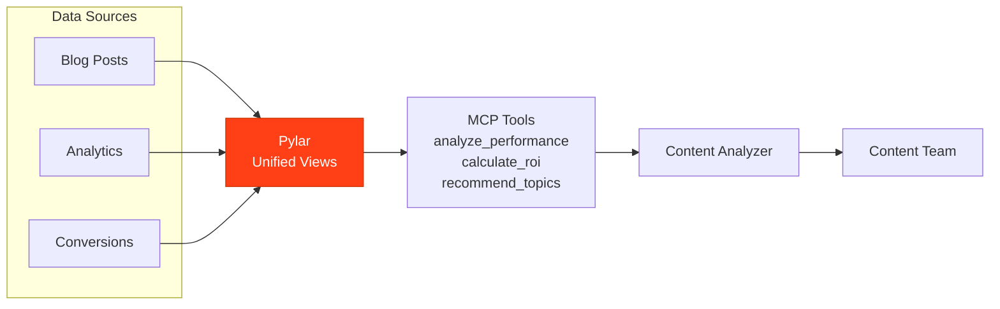

## Overview

A Content Performance Analyzer powered by Pylar analyzes blog posts, content engagement metrics, content ROI, and identifies top-performing content to inform content strategy.

## What the Agent Needs to Accomplish

The agent must:
- Analyze blog post performance
- Track content engagement metrics
- Calculate content ROI
- Identify top-performing content
- Recommend content topics
- Track content trends over time

## How Pylar Helps

Pylar enables the agent by:
- **Unified Content View**: Combining blog data, analytics, and conversion data
- **Real-time Analysis**: Querying current content performance
- **ROI Calculation**: Automated content ROI calculations
- **Trend Analysis**: Identifying content performance trends
- **Recommendation Engine**: Data-driven content recommendations



## Without Pylar vs With Pylar

### Without Pylar

**Challenges**:
- ❌ Multiple systems (CMS, analytics, CRM)
- ❌ Manual content analysis
- ❌ Difficult to correlate content with conversions
- ❌ Time-consuming ROI calculations

**Implementation Complexity**: ~4-5 weeks

### With Pylar

**Benefits**:
- ✅ Single endpoint for all content data
- ✅ Automated performance analysis
- ✅ Real-time ROI tracking
- ✅ Easy content optimization

**Implementation Complexity**: ~5-6 hours

## Step-by-Step Implementation

### Step 1: Connect Data Sources

1. **Connect CMS** (Blog posts, content metadata)
2. **Connect Analytics** (Page views, engagement, time on page)
3. **Connect CRM** (Content-to-lead conversions)

### Step 2: Create Content Views

**Content Performance View**:
```sql
CREATE VIEW content_performance AS
SELECT 
  c.post_id,
  c.title,
  c.category,
  c.publish_date,
  c.author,
  a.page_views,
  a.unique_visitors,
  a.avg_time_on_page,
  a.bounce_rate,
  l.leads_generated,
  l.conversions,
  -- Engagement score
  (a.page_views * 0.3 + a.unique_visitors * 0.4 + 
   (a.avg_time_on_page / 60) * 0.3) as engagement_score,
  -- ROI
  (l.conversions * 100) / NULLIF(a.page_views, 0) as conversion_rate
FROM cms.posts c
LEFT JOIN analytics.page_metrics a ON c.post_id = a.post_id
LEFT JOIN crm.content_leads l ON c.post_id = l.post_id;
```

### Step 3: Create MCP Tools

**Tool 1: Analyze Content Performance**
- `analyze_content_performance(post_id: string, start_date: date, end_date: date)`

**Tool 2: Get Top Performing Content**
- `get_top_performing_content(metric: string, limit: number, category: string)`

**Tool 3: Calculate Content ROI**
- `calculate_content_roi(post_id: string, period: string)`

**Tool 4: Recommend Content Topics**
- `recommend_content_topics(based_on: string, limit: number)`

## Example Agent Interactions

**User**: "What are our top performing blog posts?"

**Agent**: "Top 5 Performing Posts:
1. '10 Ways to Improve Sales' - 45K views, 8% conversion rate, $12K revenue
2. 'Customer Success Guide' - 32K views, 6.5% conversion, $8.5K revenue
3. 'Product Feature Deep Dive' - 28K views, 5.2% conversion, $6K revenue"

## Outcomes

- **Content ROI**: 40% improvement
- **Engagement**: 30% increase in average engagement
- **Conversion Rate**: 25% improvement
- **Content Strategy**: Data-driven topic selection

## Next Steps

- [Marketing Campaign Optimizer Example](/examples/marketing-campaign-optimizer)
- [A/B Testing Assistant Example](/examples/ab-testing-assistant)

