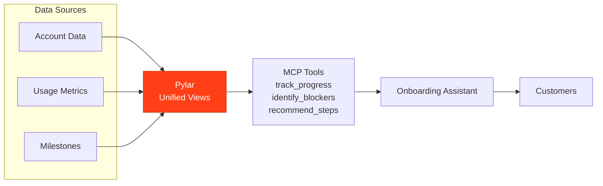

## Overview

A Customer Onboarding Assistant powered by Pylar tracks customer progress through onboarding milestones, identifies potential blockers, and provides personalized guidance based on product usage, engagement patterns, and historical onboarding data.

## What the Agent Needs to Accomplish

The agent must:
- Track customer progress through onboarding milestones
- Monitor feature adoption and usage patterns
- Identify customers who are stuck or at risk
- Provide personalized onboarding guidance
- Recommend next steps based on customer profile
- Analyze onboarding effectiveness and time-to-value

## How Pylar Helps

Pylar enables the agent by:
- **Unified Onboarding View**: Combining account data, usage metrics, and milestone tracking
- **Real-time Progress**: Querying current onboarding status across all customers
- **Pattern Recognition**: Identifying successful onboarding patterns
- **Personalized Recommendations**: Tailoring guidance based on customer profile
- **Effectiveness Analysis**: Measuring onboarding success metrics



## Without Pylar vs With Pylar

### Without Pylar

**Challenges**:
- ❌ Data scattered across product analytics, CRM, and onboarding tools
- ❌ Manual tracking of onboarding progress
- ❌ Difficult to identify at-risk customers
- ❌ No unified view of onboarding effectiveness
- ❌ Time-consuming to generate personalized recommendations
- ❌ Limited ability to correlate onboarding with outcomes

**Implementation Complexity**:
- 3-4 different system integrations
- Custom onboarding tracking logic
- Manual analysis of progress
- Complex correlation of data sources
- ~4-5 weeks development time

### With Pylar

**Benefits**:
- ✅ Single endpoint for all onboarding data
- ✅ Real-time progress tracking
- ✅ Automated at-risk customer identification
- ✅ Unified onboarding effectiveness metrics
- ✅ Easy personalized recommendations
- ✅ Built-in analytics on onboarding patterns

**Implementation Complexity**:
- Connect 3-4 data sources (1 hour)
- Create onboarding views (2.5 hours)
- Build MCP tools with AI (1 hour)
- Connect to agent builder (15 minutes)
- **Total: ~5 hours**

## Step-by-Step Implementation

### Step 1: Connect Data Sources

Connect your onboarding data sources:

1. **Connect Product Analytics** (Feature usage, user actions, engagement)
2. **Connect CRM** (Account data, customer profile, subscription tier)
3. **Connect Onboarding System** (Milestone tracking, completion status)
4. **Connect Support System** (Onboarding-related tickets)

### Step 2: Create Onboarding Views

**Onboarding Progress View**:
```sql
CREATE VIEW onboarding_progress AS
SELECT 
  c.customer_id,
  c.customer_name,
  c.account_created_date,
  DATEDIFF(CURRENT_DATE, c.account_created_date) as days_since_signup,
  c.subscription_tier,
  -- Milestone tracking
  o.milestone_1_completed,
  o.milestone_1_completion_date,
  o.milestone_2_completed,
  o.milestone_2_completion_date,
  o.milestone_3_completed,
  o.milestone_3_completion_date,
  o.milestone_4_completed,
  o.milestone_4_completion_date,
  -- Feature adoption
  u.features_activated_count,
  u.total_actions_count,
  u.active_days_count,
  u.last_activity_date,
  DATEDIFF(CURRENT_DATE, u.last_activity_date) as days_since_last_activity,
  -- Support tickets
  s.onboarding_tickets_count,
  s.last_ticket_date,
  -- Progress calculation
  (
    CASE WHEN o.milestone_1_completed THEN 25 ELSE 0 END +
    CASE WHEN o.milestone_2_completed THEN 25 ELSE 0 END +
    CASE WHEN o.milestone_3_completed THEN 25 ELSE 0 END +
    CASE WHEN o.milestone_4_completed THEN 25 ELSE 0 END
  ) as progress_percentage,
  -- Risk indicators
  CASE 
    WHEN DATEDIFF(CURRENT_DATE, c.account_created_date) > 14 
         AND o.milestone_1_completed = FALSE THEN 1
    ELSE 0
  END as stalled_flag,
  CASE 
    WHEN DATEDIFF(CURRENT_DATE, u.last_activity_date) > 7 THEN 1
    ELSE 0
  END as inactive_flag
FROM crm.customers c
LEFT JOIN onboarding.milestones o ON c.customer_id = o.customer_id
LEFT JOIN analytics.user_usage u ON c.customer_id = u.customer_id
LEFT JOIN support.onboarding_tickets s ON c.customer_id = s.customer_id;
```

**Onboarding Effectiveness View**:
```sql
CREATE VIEW onboarding_effectiveness AS
SELECT 
  o.*,
  -- Time to value metrics
  CASE 
    WHEN o.milestone_4_completed = TRUE 
    THEN DATEDIFF(o.milestone_4_completion_date, o.account_created_date)
    ELSE NULL
  END as days_to_complete,
  -- Success indicators
  CASE 
    WHEN o.progress_percentage = 100 
         AND o.days_since_last_activity <= 7 
         AND o.features_activated_count >= 3
    THEN 'Successful'
    WHEN o.progress_percentage < 50 
         AND o.days_since_last_activity > 7
    THEN 'At Risk'
    WHEN o.progress_percentage >= 50 
         AND o.progress_percentage < 100
    THEN 'In Progress'
    ELSE 'Needs Attention'
  END as onboarding_status,
  -- Recommended next steps
  CASE 
    WHEN o.milestone_1_completed = FALSE THEN 'Complete account setup'
    WHEN o.milestone_2_completed = FALSE THEN 'Import your first data'
    WHEN o.milestone_3_completed = FALSE THEN 'Create your first dashboard'
    WHEN o.milestone_4_completed = FALSE THEN 'Invite your team'
    ELSE 'Continue exploring advanced features'
  END as recommended_action
FROM onboarding_progress o;
```

**At-Risk Customers View**:
```sql
CREATE VIEW at_risk_onboarding AS
SELECT 
  e.*
FROM onboarding_effectiveness e
WHERE e.onboarding_status IN ('At Risk', 'Needs Attention')
  AND e.days_since_signup <= 30
ORDER BY e.churn_risk_score DESC, e.days_since_signup DESC;
```

### Step 3: Create MCP Tools with AI

**Tool 1: Get Onboarding Progress**
- Prompt: "Create a tool to get onboarding progress for a customer by customer ID"
- AI generates: `get_onboarding_progress(customer_id: string)`

**Tool 2: List At-Risk Customers**
- Prompt: "Create a tool to list customers who are at risk in onboarding"
- AI generates: `get_at_risk_onboarding(days_since_signup: number, limit: number)`

**Tool 3: Get Recommended Next Steps**
- Prompt: "Create a tool to get recommended next steps for a customer in onboarding"
- AI generates: `get_onboarding_next_steps(customer_id: string)`

**Tool 4: Analyze Onboarding Effectiveness**
- Prompt: "Create a tool to analyze onboarding effectiveness and time-to-value"
- AI generates: `analyze_onboarding_effectiveness(days_back: number, subscription_tier: string)`

### Step 4: Test and Publish

1. Test onboarding progress tracking
2. Verify at-risk customer identification
3. Validate next step recommendations
4. Publish tools
5. Connect to agent builder

## Example Agent Interactions

### Scenario 1: Check Onboarding Status

**User**: "What's the onboarding status for customer ABC Corp?"

**Agent** (using Pylar tools):
1. Calls `get_onboarding_progress("abc_corp")`
2. Responds:
   - "ABC Corp onboarding status: 50% complete
   - Completed: Account setup, Data import
   - Pending: Dashboard creation, Team invitation
   - Last active: 3 days ago
   - Status: In Progress
   - Recommended: Create your first dashboard"

### Scenario 2: Identify At-Risk Customers

**User**: "Show me customers who need help with onboarding"

**Agent** (using Pylar tools):
1. Calls `get_at_risk_onboarding(30, 20)`
2. Analyzes results:
   - "Found 12 at-risk customers:
     - TechCo: 25% complete, stalled on milestone 2, inactive 10 days
     - StartupXYZ: 0% complete, no activity for 14 days
     - ..."

### Scenario 3: Onboarding Effectiveness Analysis

**User**: "How effective is our onboarding process?"

**Agent** (using Pylar tools):
1. Calls `analyze_onboarding_effectiveness(90, null)`
2. Analyzes results:
   - "Onboarding effectiveness (last 90 days):
     - Average time to complete: 12 days
     - Completion rate: 68%
     - At-risk rate: 18%
     - Most common blocker: Dashboard creation (32% of stalled customers)"

## Outcomes

### Onboarding Success

- **Completion Rate**: 25% increase in onboarding completion
- **Time to Value**: 30% reduction in time-to-value
- **At-Risk Identification**: 60% earlier identification of stuck customers
- **Customer Engagement**: 40% improvement in early-stage engagement

### Efficiency Gains

- **Automated Tracking**: 80% reduction in manual tracking time
- **Proactive Outreach**: 3x increase in proactive customer outreach
- **Personalized Guidance**: 50% improvement in onboarding recommendations
- **Team Productivity**: 2x more customers managed per success manager

### Data-Driven Insights

- **Pattern Recognition**: Identification of successful onboarding paths
- **Bottleneck Analysis**: Clear visibility into where customers get stuck
- **Effectiveness Metrics**: Continuous monitoring of onboarding performance
- **Optimization Opportunities**: Data-driven improvements to onboarding flow

## Best Practices

1. **Milestone Design**: Define clear, measurable onboarding milestones
2. **Regular Monitoring**: Check onboarding progress daily
3. **Proactive Outreach**: Reach out to at-risk customers within 48 hours
4. **Personalization**: Tailor recommendations based on customer profile
5. **Continuous Improvement**: Use analytics to optimize onboarding flow

## Next Steps

- [Customer Support Agent Example](/examples/customer-support-agent) - Build a support agent
- [Customer Churn Predictor Example](/examples/customer-churn-predictor) - Predict churn
- [Product Usage Analyst Example](/examples/product-usage-analyst) - Analyze product usage

