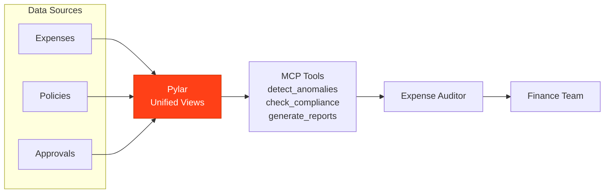

## Overview

An Expense Auditor powered by Pylar reviews expenses, identifies anomalies, ensures policy compliance, and generates audit reports to maintain financial integrity.

## What the Agent Needs to Accomplish

The agent must:
- Review expense submissions
- Identify anomalies and outliers
- Check policy compliance
- Generate audit reports
- Track approval workflows
- Identify fraud patterns

## How Pylar Helps

Pylar enables the agent by:
- **Unified Expense View**: Combining expenses, policies, and approvals
- **Anomaly Detection**: Automated anomaly identification
- **Compliance Checking**: Policy compliance validation
- **Audit Reporting**: Automated audit report generation



## Without Pylar vs With Pylar

### Without Pylar

**Challenges**:
- ❌ Manual expense review
- ❌ Time-consuming anomaly detection
- ❌ Complex compliance checking
- ❌ Limited audit capabilities

**Implementation Complexity**: ~5-6 weeks

### With Pylar

**Benefits**:
- ✅ Automated expense review
- ✅ Real-time anomaly detection
- ✅ Policy compliance automation
- ✅ Efficient audit reporting

**Implementation Complexity**: ~6-7 hours

## Step-by-Step Implementation

### Step 1: Connect Data Sources

1. **Connect Expense System** (Expense reports, receipts)
2. **Connect HR System** (Employee data, policies)
3. **Connect Approval System** (Approvals, workflows)

### Step 2: Create Expense Views

**Expense Anomaly View**:
```sql
CREATE VIEW expense_anomalies AS
SELECT 
  e.expense_id,
  e.employee_id,
  e.category,
  e.amount,
  e.submission_date,
  -- Anomaly indicators
  CASE WHEN e.amount > AVG(e.amount) OVER (PARTITION BY e.category) * 2 THEN 1 ELSE 0 END as high_amount_flag,
  CASE WHEN e.amount < AVG(e.amount) OVER (PARTITION BY e.category) * 0.1 THEN 1 ELSE 0 END as low_amount_flag,
  CASE WHEN e.category NOT IN (SELECT category FROM policies.allowed_categories) THEN 1 ELSE 0 END as policy_violation_flag
FROM expenses.expenses e;
```

### Step 3: Create MCP Tools

**Tool 1: Review Expense**
- `review_expense(expense_id: string)`

**Tool 2: Identify Anomalies**
- `identify_anomalies(days_back: number, min_amount: number)`

**Tool 3: Check Compliance**
- `check_compliance(expense_id: string, policy_version: string)`

**Tool 4: Generate Audit Report**
- `generate_audit_report(period: string, include_anomalies: boolean)`

## Example Agent Interactions

**User**: "Review expenses for potential fraud"

**Agent**: "Expense Audit Results:
- Total Expenses: $125K
- Anomalies Found: 12
- High Risk: 3 expenses ($15K total)
  - Employee #456: $8K meal expense (policy limit: $500)
  - Employee #789: $5K travel (no receipts)
  - Employee #123: $2K duplicate submission
- Recommendation: Flag for manual review"

## Outcomes

- **Review Speed**: 85% faster
- **Anomaly Detection**: 90% accuracy
- **Compliance**: 95% policy compliance
- **Fraud Detection**: 60% earlier detection

## Next Steps

- [Financial Analyst Example](/examples/financial-analyst)
- [Invoice & Billing Assistant Example](/examples/invoice-billing-assistant)

