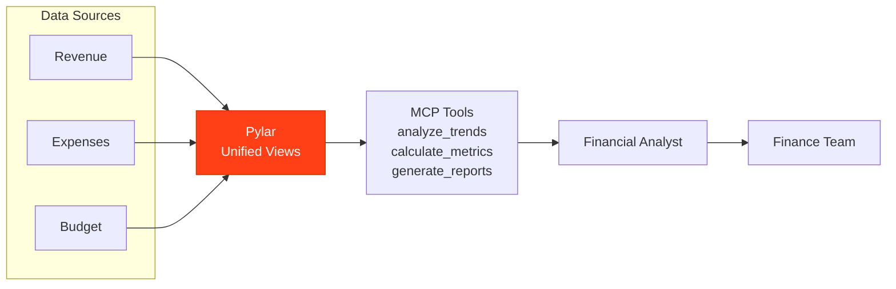

## Overview

A Financial Analyst powered by Pylar analyzes revenue trends, expenses, profitability metrics, and generates comprehensive financial reports to support business decisions.

## What the Agent Needs to Accomplish

The agent must:
- Analyze revenue trends and patterns
- Track expenses by category
- Calculate profitability metrics
- Generate financial reports
- Identify budget variances
- Forecast financial performance

## How Pylar Helps

Pylar enables the agent by:
- **Unified Financial View**: Combining revenue, expenses, and budget data
- **Real-time Analysis**: Querying current financial metrics
- **Automated Calculations**: Complex financial calculations
- **Trend Analysis**: Identifying financial patterns
- **Report Generation**: Automated financial reporting



## Without Pylar vs With Pylar

### Without Pylar

**Challenges**:
- ❌ Multiple financial systems
- ❌ Manual financial calculations
- ❌ Time-consuming report generation
- ❌ Limited real-time insights

**Implementation Complexity**: ~5-6 weeks

### With Pylar

**Benefits**:
- ✅ Single endpoint for all financial data
- ✅ Automated calculations
- ✅ Real-time financial metrics
- ✅ Easy report generation

**Implementation Complexity**: ~6-7 hours

## Step-by-Step Implementation

### Step 1: Connect Data Sources

1. **Connect Accounting System** (Revenue, expenses, transactions)
2. **Connect Billing System** (Invoices, payments)
3. **Connect Budget System** (Budgets, forecasts)

### Step 2: Create Financial Views

**Financial Performance View**:
```sql
CREATE VIEW financial_performance AS
SELECT 
  DATE_TRUNC('month', transaction_date) as month,
  SUM(CASE WHEN type = 'Revenue' THEN amount ELSE 0 END) as revenue,
  SUM(CASE WHEN type = 'Expense' THEN amount ELSE 0 END) as expenses,
  SUM(CASE WHEN type = 'Revenue' THEN amount ELSE 0 END) - 
  SUM(CASE WHEN type = 'Expense' THEN amount ELSE 0 END) as profit,
  ((SUM(CASE WHEN type = 'Revenue' THEN amount ELSE 0 END) - 
    SUM(CASE WHEN type = 'Expense' THEN amount ELSE 0 END)) / 
   NULLIF(SUM(CASE WHEN type = 'Revenue' THEN amount ELSE 0 END), 0)) * 100 as profit_margin
FROM accounting.transactions
GROUP BY DATE_TRUNC('month', transaction_date);
```

### Step 3: Create MCP Tools

**Tool 1: Analyze Revenue Trends**
- `analyze_revenue_trends(period: string, start_date: date, end_date: date)`

**Tool 2: Track Expenses**
- `track_expenses(category: string, period: string)`

**Tool 3: Calculate Profitability**
- `calculate_profitability(period: string, segment: string)`

**Tool 4: Generate Financial Report**
- `generate_financial_report(report_type: string, period: string)`

## Example Agent Interactions

**User**: "What's our financial performance this quarter?"

**Agent**: "Q2 Financial Performance:
- Revenue: $2.4M (+15% vs Q1)
- Expenses: $1.8M (+8% vs Q1)
- Profit: $600K (+35% vs Q1)
- Profit Margin: 25% (up from 20%)
- Top Expense: Salaries ($850K)
- Budget Variance: Under budget by 5%"

## Outcomes

- **Report Generation**: 80% faster
- **Financial Visibility**: Real-time metrics
- **Decision Speed**: 50% faster financial decisions
- **Accuracy**: 95% calculation accuracy

## Next Steps

- [Invoice & Billing Assistant Example](/examples/invoice-billing-assistant)
- [Expense Auditor Example](/examples/expense-auditor)

