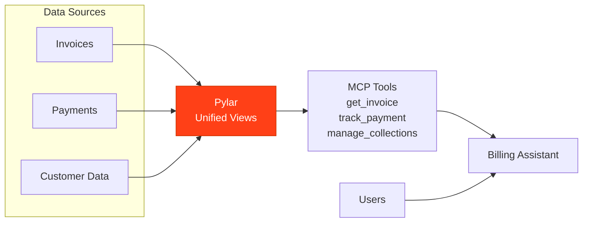

## Overview

An Invoice & Billing Assistant powered by Pylar handles billing inquiries, generates invoices, tracks payment status, and manages collections to streamline billing operations.

## What the Agent Needs to Accomplish

The agent must:
- Answer billing queries
- Generate invoices
- Track payment status
- Manage collections
- Identify overdue accounts
- Generate billing reports

## How Pylar Helps

Pylar enables the agent by:
- **Unified Billing View**: Combining invoices, payments, and customer data
- **Real-time Status**: Querying current billing and payment status
- **Automated Tracking**: Automated payment tracking
- **Collection Management**: Identifying and managing overdue accounts



## Without Pylar vs With Pylar

### Without Pylar

**Challenges**:
- ❌ Multiple billing systems
- ❌ Manual invoice generation
- ❌ Time-consuming payment tracking
- ❌ Limited collection visibility

**Implementation Complexity**: ~4-5 weeks

### With Pylar

**Benefits**:
- ✅ Single endpoint for billing data
- ✅ Automated invoice generation
- ✅ Real-time payment tracking
- ✅ Efficient collection management

**Implementation Complexity**: ~5-6 hours

## Step-by-Step Implementation

### Step 1: Connect Data Sources

1. **Connect Billing System** (Invoices, subscriptions)
2. **Connect Payment Processor** (Payments, transactions)
3. **Connect CRM** (Customer data, billing contacts)

### Step 2: Create Billing Views

**Invoice Status View**:
```sql
CREATE VIEW invoice_status AS
SELECT 
  i.invoice_id,
  i.customer_id,
  i.invoice_date,
  i.due_date,
  i.amount,
  i.status,
  p.payment_amount,
  p.payment_date,
  i.amount - COALESCE(p.payment_amount, 0) as outstanding_amount,
  DATEDIFF(CURRENT_DATE, i.due_date) as days_overdue
FROM billing.invoices i
LEFT JOIN billing.payments p ON i.invoice_id = p.invoice_id;
```

### Step 3: Create MCP Tools

**Tool 1: Get Invoice Details**
- `get_invoice_details(invoice_id: string, customer_id: string)`

**Tool 2: Track Payment Status**
- `track_payment_status(invoice_id: string)`

**Tool 3: Identify Overdue Accounts**
- `identify_overdue_accounts(days_overdue: number, min_amount: number)`

**Tool 4: Generate Invoice**
- `generate_invoice(customer_id: string, items: array, due_date: date)`

## Example Agent Interactions

**User**: "What's the status of invoice #12345?"

**Agent**: "Invoice #12345 Status:
- Customer: Acme Corp
- Amount: $5,000
- Status: Partially Paid ($2,000 paid)
- Outstanding: $3,000
- Due Date: March 15, 2024 (5 days overdue)
- Action: Send payment reminder"

## Outcomes

- **Query Response**: 80% faster
- **Payment Tracking**: 90% automation
- **Collection Efficiency**: 40% improvement
- **Customer Satisfaction**: 30% improvement

## Next Steps

- [Financial Analyst Example](/examples/financial-analyst)
- [Expense Auditor Example](/examples/expense-auditor)

