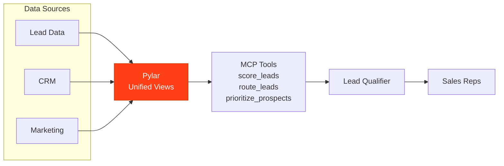

## Overview

A Lead Qualification Agent powered by Pylar automatically scores leads based on firmographic data, behavioral signals, and historical conversion patterns, then routes them to the right sales reps.

## What the Agent Needs to Accomplish

The agent must:
- Score leads based on multiple criteria
- Route leads to appropriate sales reps
- Prioritize high-value prospects
- Track lead conversion rates
- Identify lead quality trends
- Optimize routing rules

## How Pylar Helps

Pylar enables the agent by:
- **Unified Lead View**: Combining lead data, firmographics, and behavioral signals
- **Real-time Scoring**: Querying current lead data for instant scoring
- **Multi-Source Integration**: Joining lead data with CRM and marketing data
- **Pattern Recognition**: Identifying high-converting lead patterns
- **Automated Routing**: Intelligent lead distribution



## Without Pylar vs With Pylar

### Without Pylar

**Challenges**:
- ❌ Manual lead scoring
- ❌ Complex routing logic across systems
- ❌ Limited lead data integration
- ❌ Time-consuming qualification
- ❌ Inconsistent scoring

**Implementation Complexity**: ~4-5 weeks

### With Pylar

**Benefits**:
- ✅ Automated lead scoring
- ✅ Real-time routing
- ✅ Unified lead data
- ✅ Pattern-based optimization

**Implementation Complexity**: ~5-6 hours

## Step-by-Step Implementation

### Step 1: Connect Data Sources

1. **Connect Marketing Platform** (Lead data, behavioral signals)
2. **Connect CRM** (Lead conversion, historical data)
3. **Connect Firmographic Data** (Company data, industry)

### Step 2: Create Lead Scoring Views

**Lead Score View**:
```sql
CREATE VIEW lead_scoring AS
SELECT 
  l.lead_id,
  l.email,
  l.company_name,
  l.industry,
  l.company_size,
  -- Behavioral signals
  l.page_views,
  l.download_count,
  l.webinar_attended,
  -- Firmographic score
  CASE 
    WHEN l.company_size >= 1000 THEN 30
    WHEN l.company_size >= 500 THEN 20
    WHEN l.company_size >= 100 THEN 10
    ELSE 5
  END as firmographic_score,
  -- Behavioral score
  (l.page_views * 2 + l.download_count * 5 + 
   CASE WHEN l.webinar_attended THEN 10 ELSE 0 END) as behavioral_score,
  -- Total score
  (CASE WHEN l.company_size >= 1000 THEN 30 ELSE 0 END +
   CASE WHEN l.company_size >= 500 THEN 20 ELSE 0 END +
   l.page_views * 2 + l.download_count * 5 +
   CASE WHEN l.webinar_attended THEN 10 ELSE 0 END) as total_score
FROM marketing.leads l;
```

### Step 3: Create MCP Tools

**Tool 1: Score Lead**
- `score_lead(lead_id: string)`

**Tool 2: Route Lead**
- `route_lead(lead_id: string, territory: string)`

**Tool 3: Get High-Value Leads**
- `get_high_value_leads(min_score: number, limit: number)`

**Tool 4: Analyze Lead Quality**
- `analyze_lead_quality(days_back: number, source: string)`

## Example Agent Interactions

**User**: "Score and route this new lead"

**Agent**: "Lead scored: 85/100 (High Quality)
- Company: TechCorp (500 employees)
- Activity: 15 page views, 2 downloads
- Routed to: Sarah Johnson (Enterprise team)
- Recommended: Immediate outreach"

## Outcomes

- **Qualification Speed**: 80% faster
- **Conversion Rate**: 25% improvement
- **Routing Accuracy**: 40% better match
- **Sales Efficiency**: 2x more qualified leads per rep

## Next Steps

- [Sales Assistant Example](/examples/sales-assistant)
- [Marketing Campaign Optimizer Example](/examples/marketing-campaign-optimizer)

