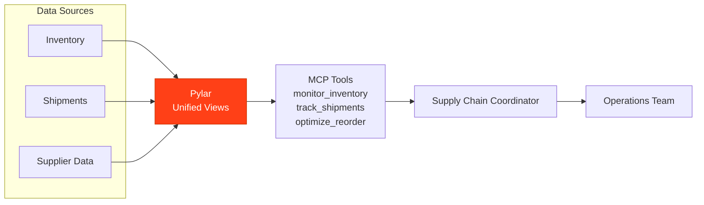

## Overview

A Supply Chain Coordinator powered by Pylar manages inventory levels, tracks shipments, optimizes reorder points, and ensures efficient supply chain operations.

## What the Agent Needs to Accomplish

The agent must:
- Monitor inventory levels
- Track shipments and deliveries
- Optimize reorder points
- Identify stockouts and overstock
- Analyze supplier performance
- Generate supply chain reports

## How Pylar Helps

Pylar enables the agent by:
- **Unified Supply Chain View**: Combining inventory, shipments, and supplier data
- **Real-time Monitoring**: Querying current inventory and shipment status
- **Automated Optimization**: Calculating optimal reorder points
- **Performance Analysis**: Analyzing supplier and logistics performance



## Without Pylar vs With Pylar

### Without Pylar

**Challenges**:
- ❌ Multiple systems (inventory, shipping, suppliers)
- ❌ Manual inventory tracking
- ❌ Complex reorder calculations
- ❌ Limited visibility

**Implementation Complexity**: ~5-6 weeks

### With Pylar

**Benefits**:
- ✅ Single endpoint for supply chain data
- ✅ Real-time inventory monitoring
- ✅ Automated reorder optimization
- ✅ Comprehensive visibility

**Implementation Complexity**: ~6-7 hours

## Step-by-Step Implementation

### Step 1: Connect Data Sources

1. **Connect Inventory System** (Stock levels, products)
2. **Connect Shipping System** (Shipments, tracking)
3. **Connect Supplier System** (Supplier data, orders)

### Step 2: Create Supply Chain Views

**Inventory Status View**:
```sql
CREATE VIEW inventory_status AS
SELECT 
  p.product_id,
  p.product_name,
  i.current_stock,
  i.reorder_point,
  i.max_stock,
  i.avg_daily_sales,
  -- Stock status
  CASE 
    WHEN i.current_stock <= 0 THEN 'Out of Stock'
    WHEN i.current_stock <= i.reorder_point THEN 'Low Stock'
    WHEN i.current_stock >= i.max_stock THEN 'Overstock'
    ELSE 'Normal'
  END as stock_status,
  -- Days until reorder
  CASE 
    WHEN i.avg_daily_sales > 0 
    THEN (i.current_stock - i.reorder_point) / i.avg_daily_sales
    ELSE NULL
  END as days_until_reorder
FROM products p
JOIN inventory.stock i ON p.product_id = i.product_id;
```

### Step 3: Create MCP Tools

**Tool 1: Check Inventory Status**
- `check_inventory_status(product_id: string, warehouse_id: string)`

**Tool 2: Track Shipment**
- `track_shipment(shipment_id: string, order_id: string)`

**Tool 3: Optimize Reorder Points**
- `optimize_reorder_points(product_id: string, lead_time_days: number)`

**Tool 4: Analyze Supplier Performance**
- `analyze_supplier_performance(supplier_id: string, period: string)`

## Example Agent Interactions

**User**: "What products need reordering?"

**Agent**: "Low Stock Alert:
- Product A: 45 units (reorder point: 100) - ORDER NOW
- Product B: 120 units (reorder point: 150) - Order in 3 days
- Product C: 0 units - OUT OF STOCK - URGENT

Supplier Performance:
- Supplier X: 98% on-time delivery, recommend for Product A
- Supplier Y: 95% on-time, recommend for Product B"

## Outcomes

- **Stockouts**: 50% reduction
- **Overstock**: 35% reduction
- **Inventory Costs**: 25% reduction
- **Efficiency**: 60% improvement

## Next Steps

- [IT Operations Monitor Example](/examples/it-operations-monitor)

