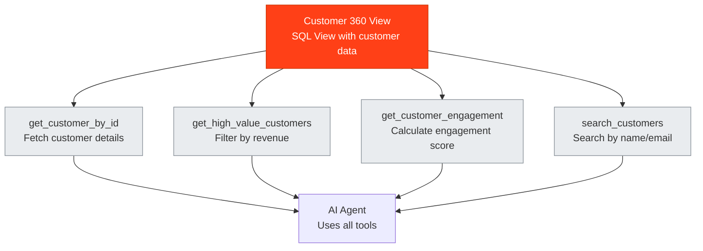

## What Are MCP Tools?

MCP (Model Context Protocol) tools are the interface between your data views and AI agents. They define how agents can query and interact with your data, translating natural language requests into structured SQL queries.

### The Role of MCP Tools

MCP tools serve as:

- **Agent Interface**: The way AI agents access your data views
- **Query Wrappers**: SQL queries tailored to specific use cases
- **Parameter Handlers**: Accept inputs from agents and inject them into queries
- **Security Layer**: Govern how agents interact with your data

<Info>
Think of MCP tools as functions that AI agents can call. Each tool has a specific purpose and knows how to query your data to fulfill that purpose.
</Info>

## How MCP Tools Work

### The Workflow

1. **Create a View**: Define what data agents can access
2. **Create MCP Tools**: Build tools on top of your view
3. **Test Tools**: Verify tools work correctly
4. **Publish Tools**: Make them available to agent builders
5. **Agents Use Tools**: AI agents call tools to query your data

### Multiple Tools Per View

A single view can have multiple MCP tools, each serving different purposes:

- **Different Parameters**: Each tool can accept different inputs
- **Different Queries**: Tools can query the same view differently
- **Different Use Cases**: Tools can be optimized for specific scenarios

<Tip>
Create multiple tools on the same view to provide agents with different ways to interact with your data. For example, one tool for filtering by date, another for filtering by customer segment.
</Tip>

## Key Concepts

### Function Name

Each tool has a unique function name that agents use to invoke it. Names should be:
- Descriptive and clear
- Follow naming conventions
- Indicate the tool's purpose

### Description

The description tells agents what the tool does. It should:
- Clearly explain the tool's purpose
- Be concise but informative
- Help agents decide when to use the tool

### SQL Query

The SQL query defines how the tool queries your view:
- Can include parameters from the agent
- Uses placeholders like `{parameter_name}`
- Can be edited and refined
- Executes against your data view

### Parameters

Parameters are inputs the tool accepts:
- Define what data agents must provide
- Can be required or optional
- Have types (string, number, etc.)
- Include descriptions for clarity

### Tool Call Arguments

Test values used to verify the tool works:
- Sample inputs for testing
- Can be modified during testing
- Help validate tool behavior

## Creating MCP Tools

### Method 1: AI-Assisted Creation (Recommended)

Use Pylar's AI to create tools from natural language:

1. Select your view in the sidebar
2. Ask the AI to create a tool
3. Review the generated tool
4. Test and refine as needed

**Example**: *"Create an MCP tool to compute the engagement score for a given event type"*

### Method 2: Manual Creation

Create tools manually for complete control:

1. Define the function name
2. Write the description
3. Create the SQL query
4. Configure parameters
5. Set test arguments

## Testing Your Tools

Before publishing, always test your tools:

1. Click "Test Run" on the tool
2. Review the query execution
3. Check the results
4. Verify parameters work correctly
5. Refine if needed

<Warning>
Never skip testing. A tool that works in testing will work in production, but a tool that fails testing will cause agent errors.
</Warning>

## Publishing Tools

Once tested, publish your tools:

1. Click "Publish" in the sidebar
2. Generate an authorization token
3. Copy the MCP HTTP Stream URL and Bearer Token
4. Connect to your agent builder

## Next Steps

Ready to create your first tool?

- [Creating Tools with AI](/learn/building-mcp-tools/creating-tools-with-ai) - Use AI to create tools from natural language
- [Creating Tools Manually](/learn/building-mcp-tools/creating-tools-manually) - Build tools with complete control
- [Understanding Tool Structure](/learn/building-mcp-tools/understanding-tool-structure) - Learn about tool components
- [Testing Your Tools](/learn/building-mcp-tools/testing-your-tools) - Verify tools work correctly

<Card
  title="Create Your First Tool"
  icon="wand-magic-sparkles"
  href="/learn/building-mcp-tools/creating-tools-with-ai"
>
  Use AI to create an MCP tool in seconds
</Card>

