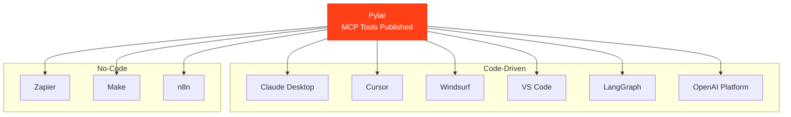

## One Control Pane, Any Agent Builder

Pylar provides a unified way to connect your data views to **any agent builder**—whether it's code-driven like LangGraph, no-code like Zapier, or AI-native like Claude Desktop. All controlled, optimized, and iterated from one place: Pylar.



## The Problem with Traditional Approaches

Traditional data access for agents requires:

- ❌ **API Development**: Building custom APIs for each agent builder
- ❌ **Scattered SQL**: SQL queries scattered across different systems
- ❌ **No Central Control**: Can't update queries from one place
- ❌ **Complex Integration**: Different integration patterns for each builder
- ❌ **Maintenance Nightmare**: Changes require updates everywhere
- ❌ **No Visibility**: Hard to see how agents are using data

## The Pylar Solution

With Pylar, you get:

- ✅ **One MCP Server**: Single connection point for all agent builders
- ✅ **Centralized Views**: Define data access once in Pylar
- ✅ **One Control Pane**: Update views and tools from Pylar, changes reflect everywhere
- ✅ **No API Code**: No need to build or maintain APIs
- ✅ **No SQL Changes Everywhere**: Update SQL in one place, all agents get updates
- ✅ **Full Visibility**: See how all agents interact with your data through Evals

<Info>
Pylar acts as a universal data access layer. Define your views once, connect any agent builder, and control everything from Pylar's dashboard.
</Info>

## How It Works

### Step 1: Define Views in Pylar

Create your data views in Pylar's SQL IDE:
- Write SQL queries
- Join across multiple databases
- Define exactly what data agents can access

### Step 2: Build MCP Tools

Create MCP tools on your views:
- Use AI to generate tools from natural language
- Or configure tools manually
- Test before publishing

### Step 3: Publish and Get Credentials

Publish your tools and receive:
- **MCP HTTP Stream URL**: Connection endpoint
- **Authorization Bearer Token**: Secure authentication

### Step 4: Connect Any Agent Builder

Paste your credentials into any agent builder:
- **Code-driven** (LangGraph, OpenAI Agents, custom code)
- **No-code** (Zapier, Make, n8n)
- **AI-native** (Claude Desktop, Cursor, Windsurf)

### Step 5: Control from Pylar

Update views or tools anytime:
- Changes reflect automatically in all connected builders
- No need to update code or configurations elsewhere
- Monitor everything through Evals

## Universal Compatibility

### Code-Driven Agent Builders

Perfect for developers building custom agents:

- **LangGraph**: Build stateful agent workflows
- **OpenAI Assistants API**: Create AI assistants
- **Custom Python/JavaScript**: Any MCP-compatible code
- **LangChain**: Framework for LLM applications

**How it works**: Use MCP client libraries to connect to Pylar's MCP server.

### No-Code Agent Builders

Perfect for non-developers building automations:

- **Zapier**: Connect apps and automate workflows
- **Make (Integromat)**: Visual automation platform
- **n8n**: Open-source workflow automation
- **Any HTTP-based tool**: Tools that support HTTP requests

**How it works**: Use HTTP requests to Pylar's MCP server endpoint.

### AI-Native Builders

Perfect for AI agent development:

- **Claude Desktop**: Anthropic's desktop AI assistant
- **Cursor**: AI-powered code editor
- **Windsurf**: AI coding assistant
- **Any MCP-compatible tool**: Tools supporting MCP protocol

**How it works**: Native MCP protocol support for seamless integration.

## Key Benefits

### For Developers

- **No API Development**: Skip building custom APIs
- **Standard Protocol**: Use MCP, the emerging standard
- **Focus on Logic**: Build agent logic, not data access code
- **Easy Updates**: Change data access without touching agent code

### For Non-Developers

- **No Code Required**: Connect via HTTP requests
- **Visual Interfaces**: Use familiar no-code tools
- **Easy Setup**: Just paste credentials
- **Automatic Updates**: Changes happen automatically

### For Organizations

- **Centralized Control**: One place to manage all data access
- **Security**: Views are the only access level
- **Compliance**: Full audit trail of all access
- **Scalability**: Add new agent builders without complexity

## The Workflow

```
┌─────────────────┐
│   Your Views    │  ← Define once in Pylar
│   (Pylar IDE)   │
└────────┬────────┘
         │
         ↓
┌─────────────────┐
│   MCP Tools     │  ← Create tools on views
│   (Pylar)       │
└────────┬────────┘
         │
         ↓
┌─────────────────┐
│  Publish Tools  │  ← Get credentials
│  (Pylar)        │
└────────┬────────┘
         │
         ├─────────────────┬─────────────────┬───────────────┐
         ↓                 ↓                 ↓               ↓
┌──────────────┐  ┌──────────────┐  ┌──────────────┐  ┌──────────────┐
│   LangGraph  │  │    Zapier    │  │   Claude     │  │   Custom     │
│   (Code)     │  │   (No-code)  │  │   (AI)       │  │   (Any)      │
└──────────────┘  └──────────────┘  └──────────────┘  └──────────────┘
         │                 │                 │               │
         └─────────────────┴─────────────────┴───────────────┘
                              ↓
                    ┌─────────────────┐
                    │   Evals (Pylar) │  ← Monitor all from one place
                    └─────────────────┘
```

## Control and Iteration

### Update Views

Change your SQL queries in Pylar:
- All connected agents automatically get updated data
- No code changes needed in agent builders
- No configuration updates required

### Optimize Tools

Refine MCP tools based on Evals:
- See how agents actually use your tools
- Identify optimization opportunities
- Update tools and see improvements immediately

### Iterate Quickly

Make changes and see results:
- Test changes in Pylar
- Publish updates
- All agents get updates automatically
- Monitor impact through Evals

<Tip>
The power of Pylar is in the control pane. Make changes once, and all your agent builders benefit immediately—no matter which platform they're built on.
</Tip>

## Next Steps

Ready to connect your agent builder?

- [Claude Desktop](/learn/connecting-agent-builders/claude-desktop) - Connect to Claude Desktop
- [Cursor](/learn/connecting-agent-builders/cursor) - Connect to Cursor
- [LangGraph](/learn/connecting-agent-builders/langgraph) - Connect to LangGraph
- [Zapier](/learn/connecting-agent-builders/zapier) - Connect to Zapier
- [Make](/learn/connecting-agent-builders/make) - Connect to Make
- [n8n](/learn/connecting-agent-builders/n8n) - Connect to n8n
- [OpenAI Agent Builder](/learn/connecting-agent-builders/openai-agent-builder) - Connect to OpenAI

<Card
  title="Connect Your Agent Builder"
  icon="plug"
  href="/learn/connecting-agent-builders/claude-desktop"
>
  Get step-by-step instructions for your agent builder
</Card>

