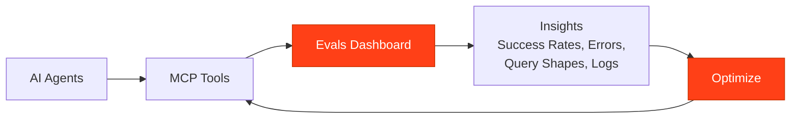

## What Are Evals?

Evals in Pylar provide comprehensive insights into how AI agents interact with your MCP tools. They give you visibility into tool usage, performance, errors, and query patterns—helping you optimize your tools and views for better agent performance.



## Why Use Evals?

Evals help you:

- ✅ **Monitor Performance**: Track success rates and error patterns
- ✅ **Identify Issues**: Find tools that fail frequently or have problems
- ✅ **Understand Usage**: See how agents are using your tools
- ✅ **Optimize Queries**: Identify slow or inefficient queries
- ✅ **Improve Tools**: Refine tools based on real agent behavior
- ✅ **Track Trends**: See how usage changes over time

<Info>
Evals are your window into production agent behavior. They show you exactly what's happening when agents use your tools.
</Info>

## Accessing Evals

To open the Evaluation Dashboard:

1. Navigate to your project in Pylar
2. Click the **"Eval"** button in the top-right corner of the screen
3. The Evaluation Dashboard opens

The dashboard provides a comprehensive view of all your MCP tool performance metrics.

## What You'll See

The Evaluation Dashboard shows:

### Summary Metrics
- **Total Count**: How many times tools were invoked
- **Success Count**: Successful invocations
- **Error Count**: Failed invocations
- **Success Rate**: Percentage of successful calls
- **Error Rate**: Percentage of failed calls

### Visual Insights
- **Time-Series Graphs**: See how usage, successes, and errors change over time
- **Trend Analysis**: Understand patterns in tool performance

### Error Analysis
- **Error Explorer**: See what errors occurred and how often
- **Query Shape**: Understand patterns in query types

### Raw Logs
- **Detailed Records**: Every tool call with full context
- **Query Details**: See exactly what queries were executed
- **Error Messages**: Understand why failures occurred

## Key Concepts

### Success vs. Error

- **Success**: Tool invocation returned a valid result
- **Error**: Tool invocation failed to return a result

### Success Rate

```
Success Rate = (Success Count ÷ Total Count) × 100
```

A higher success rate indicates better tool performance.

### Error Rate

```
Error Rate = (Error Count ÷ Total Count) × 100
```

A lower error rate is better. High error rates indicate problems that need attention.

## Using Evals to Improve

### Iterative Improvement Process

1. **Monitor**: Use Evals to see how tools perform
2. **Identify Issues**: Find errors, slow queries, or patterns
3. **Refine**: Update tools or views based on insights
4. **Verify**: Check Evals again to confirm improvements
5. **Repeat**: Continuously improve based on real usage

<Tip>
Use Evals regularly to catch issues early and continuously improve your tools. Don't wait for problems to be reported—monitor proactively.
</Tip>

## Next Steps

Ready to explore your Evals?

- [Evals Dashboard](/learn/evals/evals-dashboard) - Navigate the dashboard and understand metrics
- [Analyzing Errors](/learn/evals/analyzing-errors) - Understand error patterns and how to fix them
- [Understanding Query Shapes](/learn/evals/understanding-query-shapes) - Learn about query patterns
- [Improving Tools with Evals](/learn/evals/improving-tools-with-evals) - Use insights to optimize your tools

<Card
  title="Explore Your Dashboard"
  icon="chart-bar"
  href="/learn/evals/evals-dashboard"
>
  Learn how to navigate and understand the Evals dashboard
</Card>

