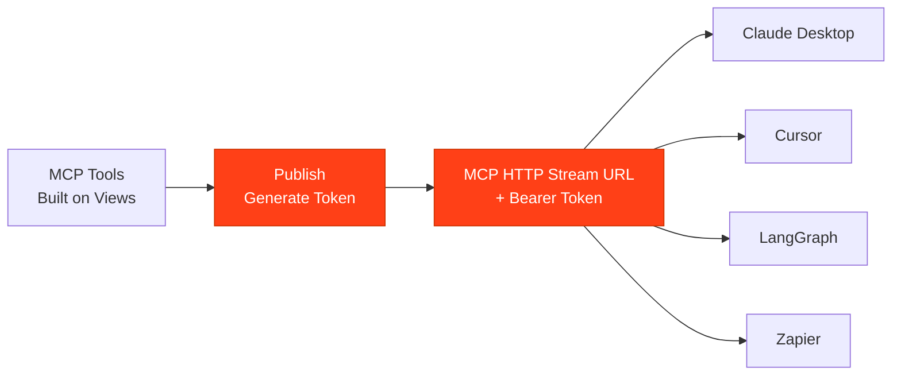

## What Is Publishing?

Publishing your MCP tools makes them available to AI agents. When you publish, Pylar generates secure connection credentials that you can use to connect your tools to any agent builder or LLM workflow.



## The Publishing Process

### Step 1: Publish Your Tools

Click the **"Publish"** button in the right sidebar to make your tools available.

### Step 2: Generate Access Credentials

Pylar generates secure authentication tokens for your tools.

### Step 3: Copy Connection Details

You'll receive:
- **MCP HTTP Stream URL**: The endpoint agents use to connect
- **Authorization Bearer Token**: Secure authentication credential

### Step 4: Connect to Agent Builders

Paste these credentials into your agent builder (Claude Desktop, Cursor, Windsurf, etc.)

## What You Get

### MCP HTTP Stream URL

The URL where your MCP server is accessible:

```
https://mcp.publish.pylar.ai/mcp
```

This is the endpoint that agent builders connect to.

### Authorization Bearer Token

A secure token that authenticates access to your tools:

```
Bearer eyJhbGciOiJIUzI1NiIsInR5cCI6IkpXVCJ9...
```

This token provides secure access to your published tools.

<Warning>
Keep your Bearer Token secure. Never share it publicly or commit it to version control. It provides access to your data.
</Warning>

## Security

### Token Security

- Tokens are unique to your project
- Regenerate tokens if compromised
- Tokens provide access to your published tools
- Store tokens securely

### Access Control

- Only published tools are accessible
- Views remain secure (agents only access through tools)
- All queries are logged and auditable
- You control what data is exposed

## After Publishing

### Automatic Updates

When you update your tools:
- Changes reflect automatically
- No need to republish
- Agents see updates immediately
- No downtime required

### Monitoring

Use Evals to see:
- How agents use your tools
- Query patterns and performance
- Errors and successes
- Usage analytics

## Next Steps

Ready to publish your tools?

- [Publishing Your Tools](/learn/publishing-tools/publishing-your-tools) - Step-by-step publishing guide
- [Getting Your Credentials](/learn/publishing-tools/getting-your-credentials) - Understanding connection details
- [Connecting to Agent Builders](/learn/publishing-tools/connecting-claude-desktop) - Connect to your agent

<Card
  title="Publish Your Tools"
  icon="paper-plane"
  href="/learn/publishing-tools/publishing-your-tools"
>
  Step-by-step guide to publishing your MCP tools
</Card>

